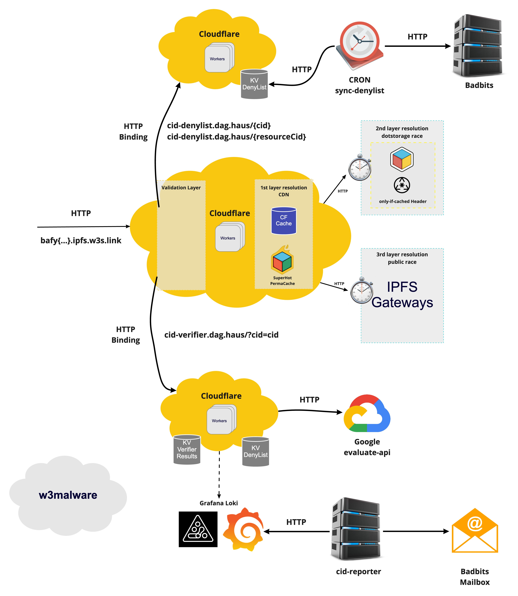

# @storacha/reads

> Libraries and services that compose the web3.storage read pipeline

# Table of Contents <!-- omit in toc -->

- [High level edge-gateway architecture](#high-level-edge-gateway-architecture)
- [Contributing](#contributing)
- [License](#license)

## High level edge-gateway architecture

# Contributing

Feel free to join in. All welcome. [Open an issue](https://github.com/storacha/reads/issues)!

If you're opening a pull request, please see the [guidelines in DEVELOPMENT.md](./DEVELOPMENT.md#how-should-i-write-my-commits) on structuring your commit messages so that your PR will be compatible with our [release process](./DEVELOPMENT.md#release).

# License

Dual-licensed under [MIT + Apache 2.0](https://github.com/storacha/reads/blob/main/LICENSE.md)
