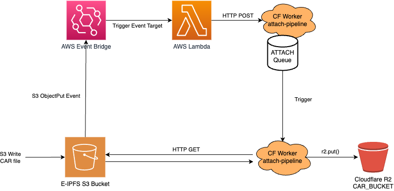

# attach-write-to-read

> Attach Pipeline is responsible for pulling CAR files written in a S3 bucket and streamming them into R2.

# Table of Contents <!-- omit in toc -->

- [High level attach pipeline architecture](#high-level-attach-pipeline-architecture)
- [Contributing](#contributing)
- [License](#license)

## High level attach pipeline architecture



The attach pipeline is composed by:
- a Gateway API running in Cloudlare Workers
- a Attach Queue to trigger requests to pull CARs
- a Car Puller handler running in Cloudflare Workers
- a R2 bucket

The Gateway endpoint receives requests with batches of CAR URLs (from S3) to be pulled into R2.

The Car Puller handler, which pulls CAR files from S3 and write them into R2 (mirroring with same key format `carCid/carCid.car`). Worth pointing out that Car Puller API is currently opinated and requires the `ETag` header provided on AWS S3 response to guarantee data integrity while writing to R2 via md5.

## Usage

The `attach-pipeline` entry point is the Gateway API. It exposes an authenticated endpoint that receives requests with batches of CAR URLs (from S3) and delegates the batch processing to a Queue.

```console
$ echo -e '{"bafy0":"https://cars.s3.amazonaws.com/bafy0/bafy0.car"}' | curl -X POST  -H 'Authorization: Basic ACCESS_KEY=' --data-binary @- https://attach-gateway.web3.storage.web3.storage
```

# Contributing

Feel free to join in. All welcome. [Open an issue](https://github.com/web3-storage/attach-pipeline/issues)!

# License

Dual-licensed under [MIT + Apache 2.0](https://github.com/web3-storage/attach-pipeline/blob/main/LICENSE.md)
