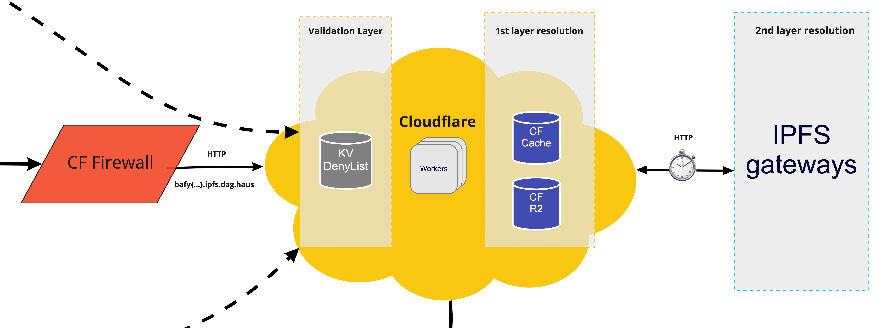
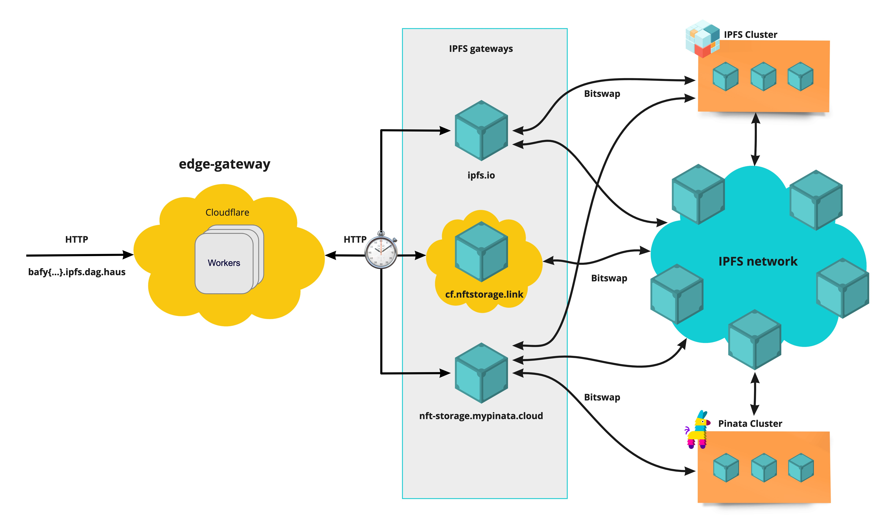

# IPFS edge gateway

The IPFS edge gateway for dotstorage reads pipeline. It is not "another IPFS gateway", but an edge layer sitting on top of existing IPFS public gateways with augmented caching capabilities.

## Getting started

- `pnpm install` - Install the project dependencies from the monorepo root directory.
- `pnpm dev` - Run the worker in dev mode.

## Environment setup

- Add secrets

  ```sh
    wrangler secret put SENTRY_DSN --env $(whoami) # Get from Sentry
    wrangler secret put LOKI_URL --env $(whoami) # Get from Loki
    wrangler secret put LOKI_TOKEN --env $(whoami) # Get from Loki
    wrangler secret put CDN_GATEWAYS_RACE --env $(whoami) # JSON String with array of CDN Gateways URLs (eg. echo -e '["https://freeway.dag.haus"]' | wrangler secret ...)
    wrangler secret put IPFS_GATEWAY_REDIRECT_HOSTNAME --env $(whoami) # string with domain to redirect if not possible to resolve within CDN (eg. echo -e 'dweb.link' | wrangler secret ...)
    wrangler secret put IPFS_GATEWAYS_RACE_L1 --env $(whoami) # JSON String with array of IPFS Gateways URLs (eg. echo -e '["https://ipfs.io","https://dagula.dag.haus"]' | wrangler secret ...)
    wrangler secret put IPFS_GATEWAYS_RACE_L2 --env $(whoami) # JSON String with array of IPFS Gateways URLs (eg. echo -e '["https://cf.dag.haus","https://w3link.mypinata.cloud"]' | wrangler secret ...)
    wrangler secret put CID_VERIFIER_AUTHORIZATION_TOKEN --env $(whoami) # Get from 1Password
  ```

- `pnpm run publish` - Publish the worker under desired env. An alias for `wrangler publish --env $(whoami)`

## High level architecture

The dotstorage IPFS edge gateway is serverless code running across the globe to provide exceptional performance, reliability, and scale. It is powered by Cloudflare workers running as close as possible to end users.

Thanks to IPFS immutable nature, a CDN cache is an excellent fit for content retrieval as a given request URL will always return the same response.

Content resolution can be decoupled into different layers. In the first resolution layer, the edge gateway leverages Cloudflare [Cache API](https://developers.cloudflare.com/workers/runtime-apis/cache) and a PermaCache to look up for content previously cached in Cloudflare CDN (based on geolocation of the end user). In the event of content not being already cached, a race with multiple IPFS gateways is performed as a second resolution layer. As soon as one gateway successfully responds, its response is forwarded to the user and stored into Cloudflare Cache.

A validation layer guarantess CIDs that have been flagged for various reasons (copyright violation, malware, etc) are not resolved.



Zooming out to a high level view:



Relevant details:

- Cloudflare Cache is [limited](https://developers.cloudflare.com/workers/platform/limits/#cache-api-limits) to 512 MB size objects.
- Cloudflare Cache is an LRU Cache
- This is an internal service to be used by dotstorage products. Accordingly, public traffic is blocked by a Firewall. If you are looking for a IPFS gateway to use, please use one of the dotstorage products ([nftstorage.link](nftstorage.link) or [w3s.link](w3s.link)).

## Deny List

We rely on [badbits](https://github.com/protocol/badbits.dwebops.pub) denylist together wtth our own denylist to prevent serving malicious content to gateway users.

When new malicious content is discovered, it should be reported to [badbits](https://github.com/protocol/badbits.dwebops.pub) denylist given it is shared among multiple gateways. When the reported CIDs are added into badbits, we just need to force our [denylist sync workflow](https://github.com/storacha/reads/actions/workflows/cron-denylist.yml) to run manually.

As a workaround, or to block content only relevant for dotstorage we can simply use our denylist as described in our [CLI documentation](./scripts/README.md).

## Metrics

Metrics are collected from logs pushed into Grafana Loki, as well as using Cloudflare Analytics engine via Worker bindings.

## Contributing

Feel free to join in. All welcome. [Open an issue](https://github.com/storacha/reads/issues)!

If you're opening a pull request, please see the [guidelines in DEVELOPMENT.md](https://github.com/storacha/reads/blob/main/DEVELOPMENT.md#how-should-i-write-my-commits) on structuring your commit messages so that your PR will be compatible with our [release process](https://github.com/storacha/reads/blob/main/DEVELOPMENT.md#release).

## License

Dual-licensed under [MIT + Apache 2.0](https://github.com/storacha/reads/blob/main/LICENSE.md)
